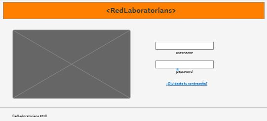
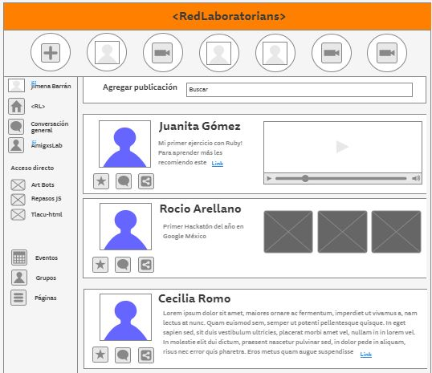
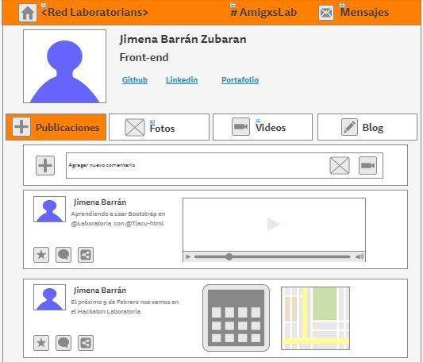
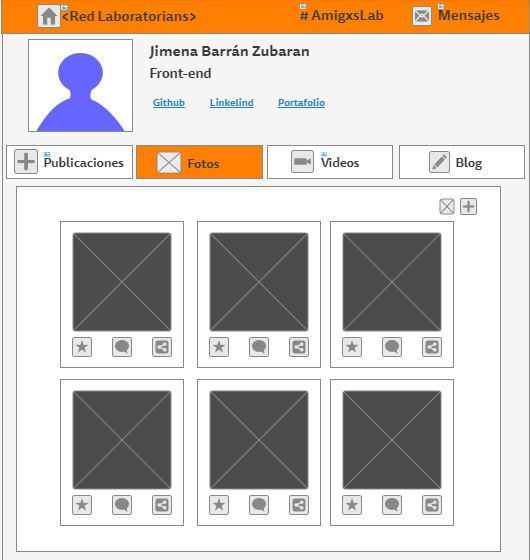
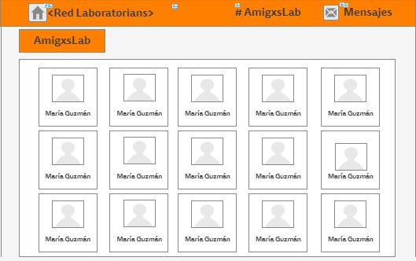
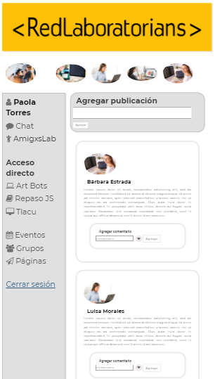

# Red Social

Un emprendedor muy visionario nos ha encargado crear una red social. No nos da mucho detalle sobre qué tipo de red social quiere, él solo nos dice que creemos la que mejor podamos y que luego lo convenzamos de que nuestra red social será la más exitosa.

## Algunos puntos básicos que debe tener una red social:

* Perfiles de usuarios
* Un newsfeed donde puedes ver las actualizaciones de todos tus contactos
* Un lugar donde poder escribir posts
* Un lugar para subir fotos
* Capacidad para poder tener amigos o para poder seguir a personas/marcas dentro de la red social
* Ser mobile friendly


### ¿QUÉ SE REQUIERE?
* Trabajar en parejas
* Tener una planificación
* La definición del diseño
* Diseño mobile friendly
* Desplegar el producto en Github Pages
* Opcional, si se desarrolla un login o se desea almacenar la información en una base de datos, usar Firebase.


### Descripción
RedLaboratorians es una red social para alumnas y egresadas de Laboratoria en la que se puede compartir información, tips y comentarios sobre el mundo Tech. 
La red social cuenta con:
* Login con google para que el usuario se autentifique para acceder a la aplicación
* Un nesfeed en el que se pueden visualizar los comentarios de las personas que pertenecen a la red y desde el cual se      pueden realizar post directamente
* Sección de profile para cada usuario donde se pueden agregar post
* Sección de amigos. Al hacer click sobre cada uno de ellos se puede acceder a sus perfiles y hacer comentarios
* Sección de fotografías para visualizar las fotografías propias
* Disponible para desktop y mobile
```
Chrome, Safari, Internet explorer...
```

### <RedLaboratorians>
Sketch para elaboración de producto






###Producto final
####Log in

####News feed

####Profile

####Photos

####Friends

####Profile´s friend


## < l a b o r a t o r i a >
